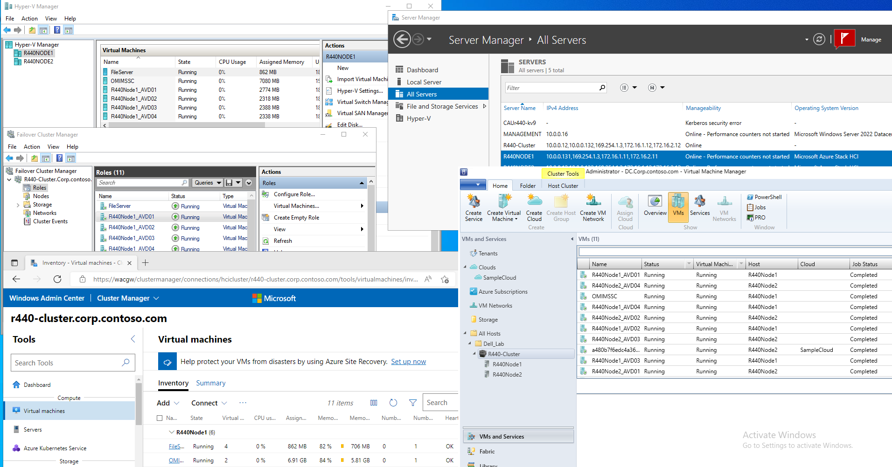
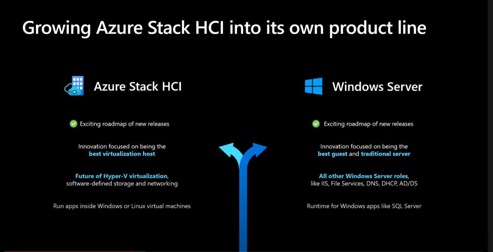
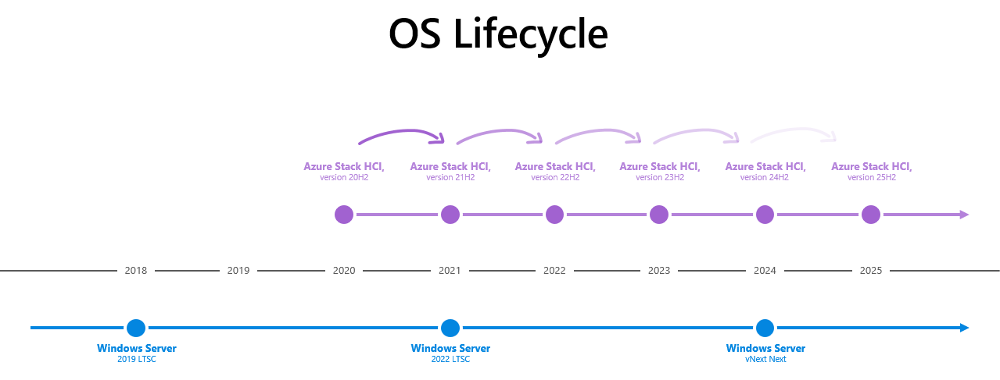
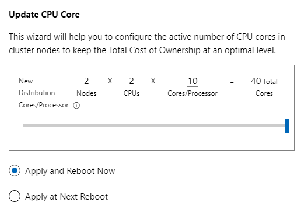
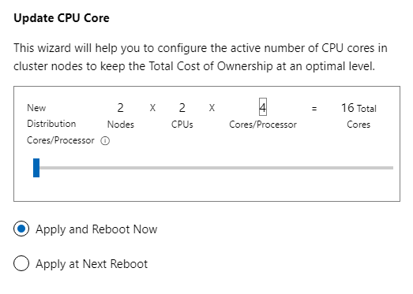
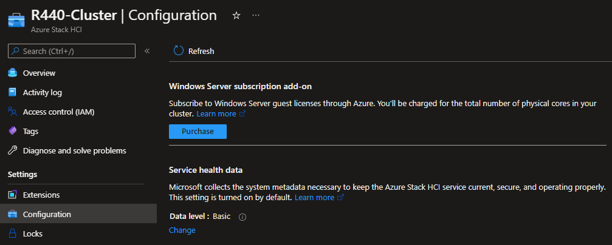

# Planning Operating System

Storage Spaces Direct is technology, that is contained in both Azure Stack HCI OS and Windows Server Datacenter. It enables you to create hyperconverged cluster as there is a software storage bus, that enables every cluster node to access all physical disks in cluster.

Both operating systems are easy to use for Windows Server admins that are familiar with failover clustering as both systems are using traditional technologies (Failover Clustering, Hyper-V) while domain joined. Therefore all tools (such as Server Manager, MMC and Windows Admin Center) can be used for management.

While both Windows Server and Azure Stack HCI operating systems can run on virtualization host, going forward the main focus will be Azure Stack HCI OS for hosts and Windows Server for guest workloads (https://youtu.be/EWv5JUHDR1k?t=423). Comparison of Azure Stack HCI and Windows Server is available [in official docs](https://docs.microsoft.com/en-us/azure-stack/hci/concepts/compare-windows-server)

## OS Lifecycle

The main difference is the way features are developed for each platform. Windows Server follows traditional development cycle (new version every 2.5-3years), while Azure Stack HCI follows cloud development cycle together with Windows Client OS (new version every year).

As result, [new features](https://docs.microsoft.com/en-us/azure-stack/hci/concepts/compare-windows-server#compare-technical-features) are developed and delivered into Azure Stack HCI OS every year.

## Licensing

The difference between both products is in way the service is consumed. With Windows Server, it's traditional "buy and forget" model, where you can have operating system that is supported for 5+5 years (main+extended support) and you can pay upfront (OEM License, EA License ...). Azure Stack HCI licensing can be dynamic. Imagine investing into the system where you have 40 cores/node, but you will initially use 16 cores only - you can easily configure number of cores in DELL systems using Openmanage Integration in Windows Admin Center and then pay only for how much you consume.

Additionally you can purchase Windows Server licenses as [subscription add-on](https://docs.microsoft.com/en-us/azure-stack/hci/manage/vm-activate#windows-server-subscription)

