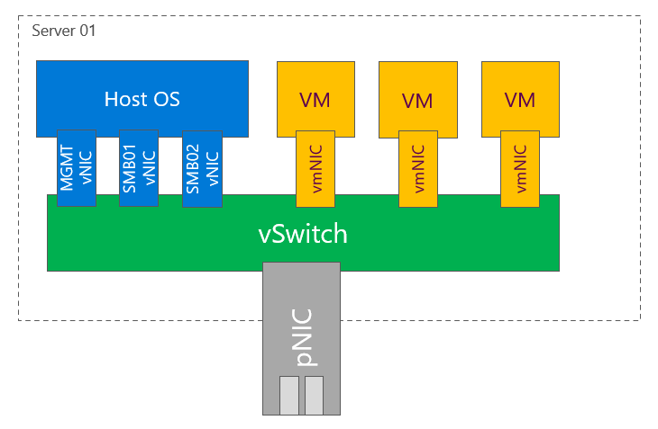
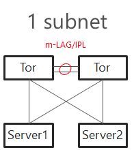
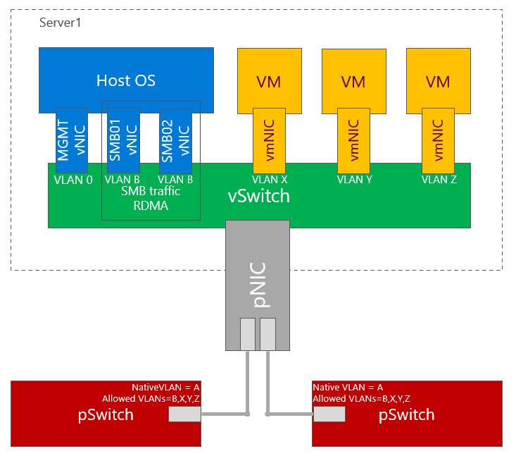
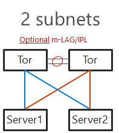
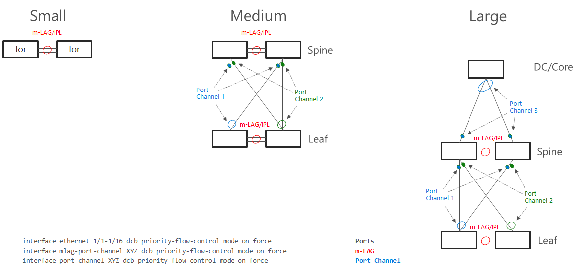
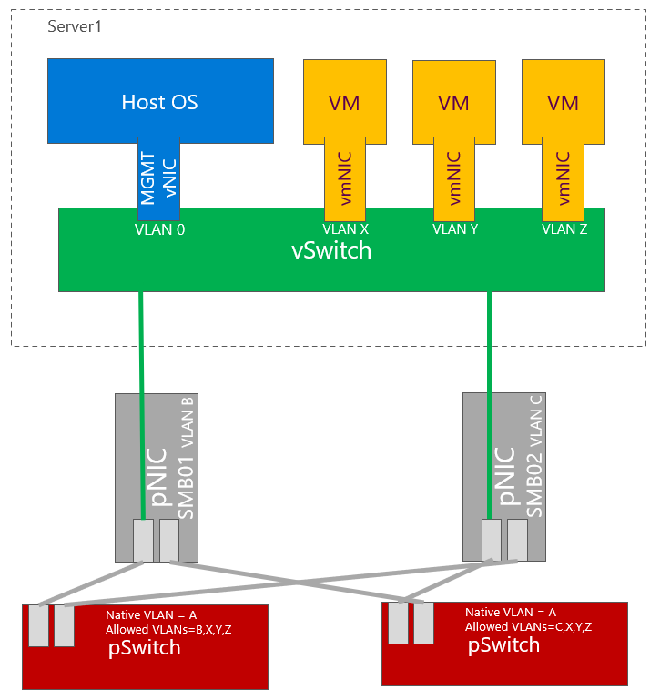
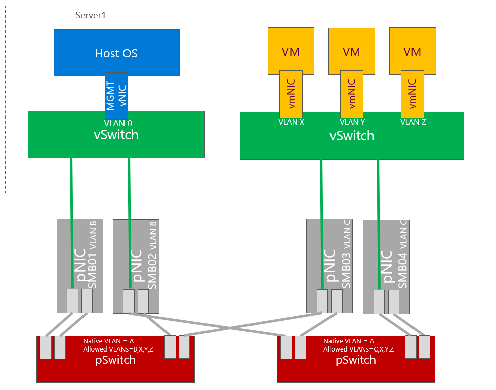

# Planning Network Architecture

To correctly plan infrastructure design is key part in Azure Stack HCI planning. With incorrect configuration, the infrastructure might not be reliable under load. Depending on scale more complex solution might make sense to better control traffic.

In general there are two types of traffic - East-West and North-South. East-West is handled by SMB protocol (all traffic generated by Storage Bus Layer and Live Migration). North-South is mostly traffic generated by Virtual Machines.

Physicals switches should be configured with native VLAN for management traffic. This will significantly help as without configuring VLAN on physical host, you will be able to communicate over network. This helps bare metal deployment and also helps with Virtual Switch creation when management network is using vNIC. 


In text above were several abbreviations used. Let's explain few.

- pSwitch = Physical Switch. It's your Top of the rack Switch (TOR)
- vSwitch = Virtual Switch. It is switch, that is created on host using New-VMSwitch command
- vNIC = Virtual Network Adapter. It is a vNIC that is connected to Management OS (to parent partition). This is the NIC that is usually used for management or SMB.
- vmNIC = Virtual Machine Network Adapter. This is a vNIC connected to Virtual Machine.



## Topology design

### Single subnet

In Windows Server 2016 was support for single subnet multichannel in cluster support added. This allows to configure only single subnet for multiple network adapters dedicated for SMB Traffic. It is recommended topology design for smaller deployments, where interconnection between TOR switches can handle at least 50% network throughput generated by nodes (as there is 50% chance, that traffic travel using switch interconnect - m-LAG). For example with 4 nodes each node 2 times 25Gbps connections, you should have at least 100Gbps connection between TOR switches.



TOR Switches will be configured with Trunk and native (access) VLAN for management.



### Two subnets

With increased number of nodes, there might be a congestion in TOR switches interconnect. Also in case congestion will happen and pause frame will be sent, both switches will be paused. To mitigate both, you can configure 2 subnets - each network switch will host separate subnet. This also brings one benefit - in converged setup if connection fails, it will be visible in failover cluster manager. m-LAG is optional if switches are dedicated for East-West (SMB) only. In this case as there is no traffic generated from SMB multichannel as each SMB adapter is in different subnet. In case VMs or any other traffic is using it, m-LAG is required.



TOR Switches will be configured with Trunk and native (access) VLAN for management with one slight difference from single subnet. Each subnet for SMB traffic will have it's own VLAN. This will also help discover disconnected physical connections (https://youtu.be/JxKMSqnGwKw?t=204).


> Note: Two subnet deployment is being now standard. Same approach is used when [NetworkATC](https://docs.microsoft.com/en-us/azure-stack/hci/deploy/network-atc) is deployed.

### Direct connections (Switchless)

In Windows Server 2019 you can connect all nodes in mesh mode. In case you have 2 nodes, it's just one connection. With 3 nodes, it's 3 interconnects. With 5 nodes, it whoops to 10. For 2 or 3 nodes design it makes sense to use 2 connections between 2 nodes in case one link goes down (for example cable failure). This would result traffic going over slower connection (like 1Gb if North-South is using Gigabit network links). Dell supports up to 4 nodes in switchless configuration.

The math is simple. With 5 nodes its 4+3+2+1=10. Each connection requires separate subnet.

```powershell
#calculation for number of connections
$NumberOfNodes=5
(1..($NumberOfNodes-1) | Measure-Object -Sum).Sum
```


## RDMA Protocols

RDMA is not required for Azure Stack HCI, but it is highly recommended. It has lower latency as traffic is using hardware data path (application can send data directly to hardware using DMA).

Great resources explaining benefit of RDMA:

- [Blog comparing storage performance with and without RDMA](https://techcommunity.microsoft.com/t5/storage-at-microsoft/to-rdma-or-not-to-rdma-8211-that-is-the-question/ba-p/425982)
- [RDMA protocol deep dive video](https://channel9.msdn.com/Blogs/Regular-IT-Guy/Behind-the-Scenes-with-Storage-Replica-and-RDMA)

There are multiple favors of RDMA. The most used in Azure Stack HCI are RoCEv2 and iWARP. Infiniband can be used also, but just for SMB traffic (NICs cannot be connected to vSwitch). 


### iWARP

iWARP is using TCP for transport. This is bit easier to configure as it uses TCP for Congestion Control. Configuring DCB/ETS is not mandatory. For larger deployments it is recommended as traffic can be prioritized.

Some network vendors require to configure Jumbo Frames to 9014.

### RoCE

RoCE is using UDP for transport. Since it's UDP, it requires lossless L2. It is mandatory to enable DCB (PFC/ETS) and ECN on both physical NICs and physical network infrastructure.

If Congestion control mechanisms are not correctly implemented, it can lead to huge retransmits. This can lead to infrastructure instabilities and storage disconnections. It is crucial to configure this correctly.

**where DCB needs to be configured**



## Virtual Switch and Virtual Network adapters

### Converged Design

This design is most common as it is simplest and requires just two ports. Since RDMA can be enabled on vNICs. In the example below is one VLAN used for SMB vNICs. As mentioned in above text, you may consider using two VLANs and two subnets for SMB vNICs to control traffic flow as it is becoming standard.

Converged design also makes best use of capacity (let's say you have 4x25Gbps NICs), you can then use up to 100Gbps capacity for storage or Virtual Machines, while using latest technology such as [VMMQ](https://docs.microsoft.com/en-us/windows-hardware/drivers/network/overview-of-virtual-machine-multiple-queues).


### Dedicated NICs for East-West traffic

Some customers prefer to dedicate physical network adapters for east west traffic. In example below all physical ports on physical switch are configured the same (for simplicity). Also just two physical switches are used. You can also have dedicated switches for east-west traffic (for SMB). If DCB is configured, VLANs are mandatory for SMB adapters. In example below one VLAN for SMB is used. Two VLANs and two subnets can be used to better control traffic.



### Dedicated NICs for East-West traffic and management

Some customers even prefer to have dedicated network cards (ports) for management. One of the reason can be customers requirements to have dedicated physical switches for management.



## Network adapters hardware

Network adapters that support all modern features such as VMMQ or SDN offloading are in Hardware Compatibility list listed as **Software-Defined Data Center (SDDC) Premium** Additional Qualifier. For more information about Hardware Certification for Azure Stack HCI you can read this 2 part blog - 
[part1](https://blogs.technet.microsoft.com/windowsserver/2018/02/20/the-technical-value-of-wssd-validated-hci-solutions-part-1/), [part2](https://blogs.technet.microsoft.com/windowsserver/2018/02/21/the-technical-value-of-validated-hci-solutions-part-2/).


