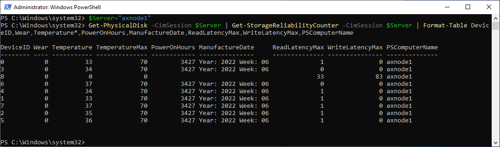

# Storage Devices

<!-- TOC -->

- [Storage Devices](#storage-devices)
    - [Resources](#resources)
    - [Interfaces](#interfaces)
    - [Storage Protocol](#storage-protocol)
    - [Storage Configurations](#storage-configurations)
    - [OS Disks](#os-disks)
    - [Consumer-Grade SSDs](#consumer-grade-ssds)
    - [Exploring Stack with PowerShell](#exploring-stack-with-powershell)
        - [Get-PhysicalDisk](#get-physicaldisk)
        - [Storage Reliability Counter](#storage-reliability-counter)
    - [Performance results](#performance-results)

<!-- /TOC -->


## Resources

Microsoft Documentation

* https://learn.microsoft.com/en-us/azure-stack/hci/concepts/choose-drives
* https://learn.microsoft.com/en-us/azure-stack/hci/concepts/drive-symmetry-considerations

NVMe vs SATA

* https://sata-io.org/sites/default/files/documents/NVMe%20and%20AHCI%20as%20SATA%20Express%20Interface%20Options%20-%20Whitepaper_.pdf
* http://www.nvmexpress.org/wp-content/uploads/2013/04/IDF-2012-NVM-Express-and-the-PCI-Express-SSD-Revolution.pdf
* https://nvmexpress.org/wp-content/uploads/NVMe-101-1-Part-2-Hardware-Designs_Final.pdf
* https://nvmexpress.org/wp-content/uploads/NVMe_Infrastructure_final1.pdf
* https://www.storagereview.com/review/dell-emc-poweredge-r750-hands-on
* https://dl.dell.com/manuals/common/dellemc-nvme-io-topologies-poweredge.pdf
* https://www.servethehome.com/dell-emc-poweredge-r7525-review-flagship-dell-dual-socket-server-amd-epyc/

## Interfaces

While SATA is still well performing for most of the customers (see performance results), NVMe offers benefit of higher capacity and also more effective protocol (AHCI vs NVMe), that was developed specifically for SSDs (opposite to AHCI, that was developed for spinning media). SATA/SAS is however not scaling well with the larger disks.


* Source: https://nvmexpress.org/wp-content/uploads/NVMe-101-1-Part-2-Hardware-Designs_Final.pdf

There is also another aspect of performance limitation of SATA/SAS devices - the controller. All SATA/SAS devices are connected to one SAS controller (non-raid) that has limited speed (only one PCI-e connection).

Drive Connector is universal (U2, also known as SFF-8639)


* Source: https://nvmexpress.org/wp-content/uploads/NVMe_Infrastructure_final1.pdf

NVMe drives are mapped directly to CPU


* Source: https://dl.dell.com/manuals/common/dellemc-nvme-io-topologies-poweredge.pdf

NVMe backplane connection - Example AX7525 - 16 PCIe Gen4 lanes in each connection (8 are used), 12 connections in backplane, in this case no PCIe switches.


* Source: https://www.servethehome.com/dell-emc-poweredge-r7525-review-flagship-dell-dual-socket-server-amd-epyc/dell-emc-poweredge-r7525-internal-view-24x-nvme-backplane-and-fans/

## Storage Protocol

SSDs were originally created to replace conventional rotating media. As such they were designed to connect to the same bus types as HDDs, both SATA and SAS (Serial ATA and Serial Attached SCSI).

However, this imposed speed limitations on the SSDs.  Now a new type of SSD exists that attaches to PCI-e. Known as NVMe SSDs or simply NVMe.

For 1M IOPS, NVMe has more than [50% less latency with less than 50% CPU Cycles used](https://www.nvmexpress.org/wp-content/uploads/2013/04/IDF-2012-NVM-Express-and-the-PCI-Express-SSD-Revolution.pdf). It is due to [improved protocol](https://en.wikipedia.org/wiki/NVM_Express#Comparison_with_AHCI) (AHCI vs NVMe)

## Storage Configurations

(slowest to fastest)

* Hybrid (HDD+SSD)
* All Flash (All SSD)
* NVMe+HDD
* All-NVMe

When combining multiple media types, faster media will be used as caching. While it is recommended to use 10% of the capacity for cache, it should be noted, that it is just important to not spill the cache with the production workload, as it will dramatically reduce performance. Therefore all production workload should fit into the Storage Bus Layer Cache (cache devices). The sweet spot (price vs performance) is combination of fast NVMe (mixed use or write intensive) with HDDs. For performance intensive workloads it's recommended to use all-flash solutions as caching introduces ~20% overhead + less predicable behavior (data can be already destaged...), therefore it is recommended to use All-Flash for SQL workloads.

Performance drop when spilling cache devices:


* Source: https://web.archive.org/web/20160817193242/http://itpeernetwork.intel.com/iops-performance-nvme-hdd-configuration-windows-server-2016-storage-spaces-direct/

## OS Disks

In Dell Servers are BOSS (Boot Optimized Storage Solution) cards used. In essence it card wih 2x m2 2280 NVMe disks connected to PCI-e with configurable non-RAID/RAID 1


## Consumer-Grade SSDs

You should avoid any consumer grade SSDs as consumer grade SSDs might contain NAND with higher latency (therefore there can be performance drop after spilling FTL buffer) or because consumer grade SSDs are not power protected (PLP). You can learn more about why consumer-grade SSDs are not good idea in a [blog post](https://techcommunity.microsoft.com/t5/storage-at-microsoft/don-t-do-it-consumer-grade-solid-state-drives-ssd-in-storage/ba-p/425914). Consumer-grade SSDs do also have lower DWPD (Disk Written Per Day). You can learn about DWPD in [this blogpost](https://blogs.technet.microsoft.com/filecab/2017/08/11/understanding-dwpd-tbw/)

## Exploring Stack with PowerShell

### Get-PhysicalDisk

```PowerShell
$Server="axnode1"
Get-PhysicalDisk -CimSession $Server | Format-Table FriendlyName,Manufacturer,Model,SerialNumber,MediaType,BusType,SpindleSpeed,LogicalSectorSize,PhysicalSectorSize
 
```


From screenshot you can see, that AX640 BOSS card reports as SATA device with Unspecified Mediatype, while SAS disks are reported as SSDs, with SAS BusType. Let's deep dive into BusType/MediaType a little bit (see table below)


Storage Spaces requires BusType SATA/SAS/NVMe or SCM. BusType RAID is unsupported.

You can also see Logical Sector Size and Physical Sector size. This refers to Drive Type (4K native vs 512E vs 512).

"LogicalSectorSize" value|"PhysicalSectorSize" value         |Drive type
:----:                   |:----:                             |:----:
4096                     |4096                               |4K native
512                      |4096                               |Advanced Format (also known as 512E)
512                      |512                                |512-byte native

Reference
* https://learn.microsoft.com/en-US/troubleshoot/windows-server/backup-and-storage/support-policy-4k-sector-hard-drives
* https://learn.microsoft.com/en-us/previous-versions/windows/it-pro/windows-server-2008-R2-and-2008/hh147334(v=ws.10)?redirectedfrom=MSDN


### Storage Reliability Counter

Once disk is added to storage spaces, S.M.A.R.T. attributes can be filtered out. For reading disk status (such as wear level temperatures...) can be get-storagereliability counter used. 

```PowerShell
$Server="axnode1"
Get-PhysicalDisk -CimSession $Server | Get-StorageReliabilityCounter -CimSession $Server | Format-Table DeviceID,Wear,Temperature*,PowerOnHours,ManufactureDate,ReadLatencyMax,WriteLatencyMax,PSComputerName
 
```



## Performance results

From the results below you can see that SATA vs SAS vs NVMe is 590092 vs 738507 vs 1496373 4k 100% read IOPS. All measurements were done with VMFleet 2.0 https://github.com/DellGEOS/AzureStackHOLs/tree/main/lab-guides/05-TestPerformanceWithVMFleet

The difference between SAS and SATA is also 8 vs 4 disks in each node. The difference between SAS and NVMe is more than double.

* [AX6515 - 2nodes, 16 cores and 4xSATA SSDs each](./media/AX6515-All-Flash-8SATA-SSDs-32VMs-2Node.txt)
* [AX6515 - 2nodes, 16 cores and 4xSATA SSDs each, secured core and deduplication enabled](./media/AX6515-All-Flash-8SATA-SSDs-32VMs-2Node-SC-Dedup.txt)
* [AX6515 - 2nodes, 16 cores and 4xSATA SSDs each, secured core enabled](./media/AX6515-All-Flash-8SATA-SSDs-32VMs-2Node-SC.txt)
* [AX6515 - 2nodes, 16 cores and 4xSATA SSDs each, secured core & BitLocker enabled](./media/AX6515-All-Flash-8SATA-SSDs-32VMs-2Node-SC-Bitlocker.txt)
* [AX6515 - 2nodes, 16 cores and 8xSAS SSDs each](./media/AX6515-All-Flash-16SAS-SSDs-32VMs-2nodes-azshci.txt)
* [R640 - 2nodes, 32 cores and 8xNVMe SSDs each](./media/R640-All-NVMe-16NVMe-64VMs-2Node.txt)
