# Partition Manager

<!-- TOC -->

- [Partition Manager](#partition-manager)
    - [Introduction](#introduction)
    - [PowerShell walkthrough](#powershell-walkthrough)
    - [Exploring Storage Spaces just storage spaces, not storage spaces direct with PowerShell](#exploring-storage-spaces-just-storage-spaces-not-storage-spaces-direct-with-powershell)

<!-- /TOC -->

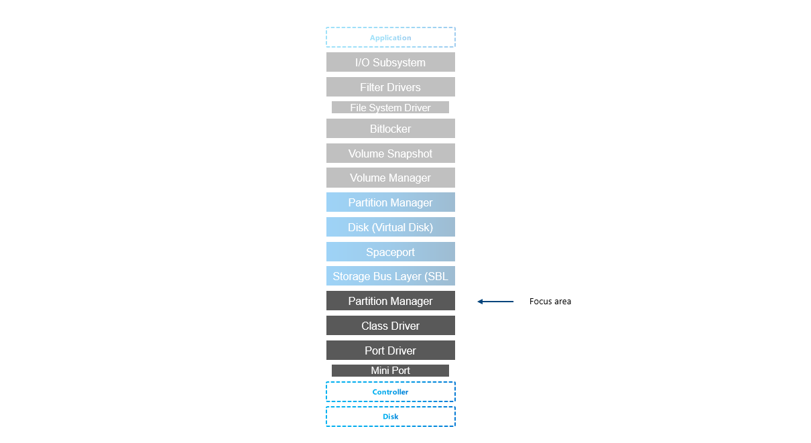

## Introduction

Partition manager has several responsibilities:
* is responsible for discovering, creating, deleting and managing partitions. 

* ensures, that all disks and partitions have unique ID.

* queries information from MSFT_Disk API class that queries information from MSFT_PhysicalDisk.

* Brings disk online/offline

* Initializes disk (GPT/MBR partitioning style)

## Resources

Microsoft Documentation

* https://learn.microsoft.com/en-us/windows-hardware/drivers/storage/msft-disk


Other

* https://en.wikipedia.org/wiki/Master_boot_record
* https://en.wikipedia.org/wiki/GUID_Partition_Table


## PowerShell walkthrough

```PowerShell
Get-PhysicalDisk

Get-PhysicalDisk | Get-Disk
 
```

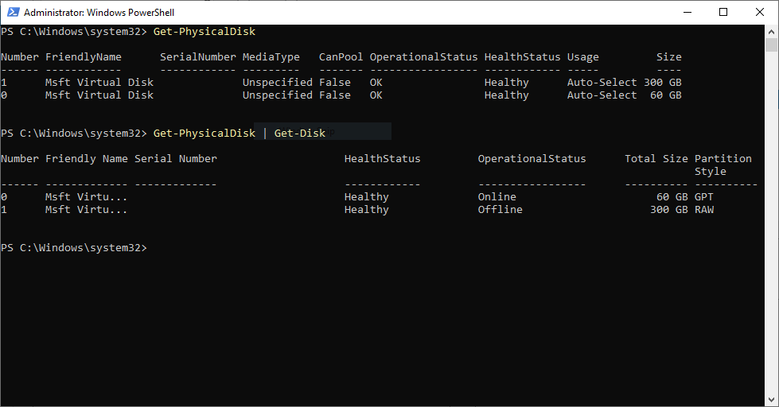

As you can see, you can first query physical disks, and from physical disks you can query Disk. It shares the number, and several other properties such as SerialNumber, Size...

What you can see from Get-Disk is operational status. In Windows Server is [SAN Policy](https://learn.microsoft.com/en-us/windows-hardware/customize/desktop/unattend/microsoft-windows-partitionmanager-sanpolicy) configured to mount all disks except those on a shared bus. Therefore disks are not mounted by default (configurable by running Set-StorageSetting)

First thing you might want to do to be able to use disk in windows subsystem is to initialize it

```PowerShell
Get-Disk -Number 1 | Initialize-Disk -PartitionStyle GPT
 
```

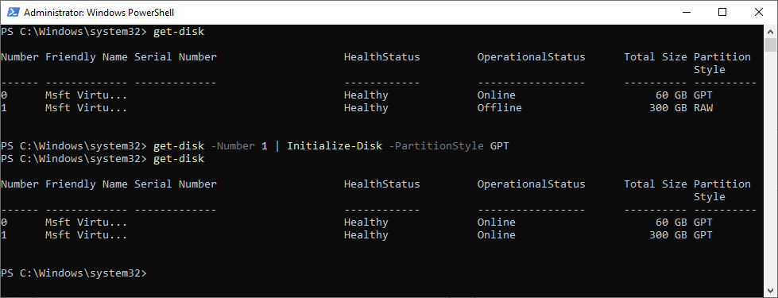

As you can see, there are two partition styles - MBR and GPT. 

GPT (GUID Partition Table) and MBR (Master Boot Record) are two different partition styles that can be used to organize the storage space on a hard drive or solid-state drive. The main differences between the two are:

**Disk Size:** MBR partition style supports a maximum disk size of 2 TB, while GPT supports disks larger than 2 TB.

**Number of partitions:** MBR supports a maximum of four primary partitions or three primary partitions and one extended partition that can be further divided into logical partitions. GPT supports up to 128 partitions.

**Boot process:** MBR uses a bootloader that is stored in the first sector of the disk, while GPT uses a bootloader that is stored in a dedicated EFI System Partition (ESP).

**Backup and recovery:** GPT has a backup copy of the partition table stored at the end of the disk. This can be used to recover the partition table if the primary copy is damaged, MBR doesn't have this feature.

**Security:** GPT includes a unique disk identifier and a cyclic redundancy check (CRC) value for each partition, which helps to prevent data corruption and other issues caused by disk errors.

In terms of compatibility, MBR is compatible with older systems that only support BIOS, while GPT is required for UEFI-based systems and can be read by both BIOS and UEFI firmware. In general, GPT is considered more robust and flexible than MBR, and it's recommended to use GPT as the partition style on modern systems.

You can display partition style in both PowerShell (Get-Disk) and Server Manager

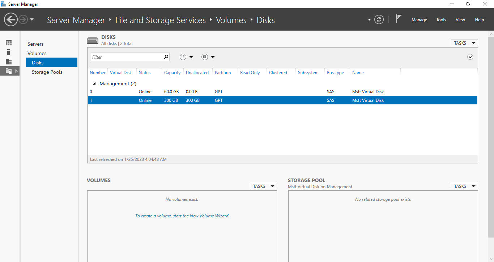

Adding partition

```PowerShell
Get-Disk -Number 1 | New-Partition -UseMaximumSize
Get-Disk -Number 1 | Get-Partition
 
```

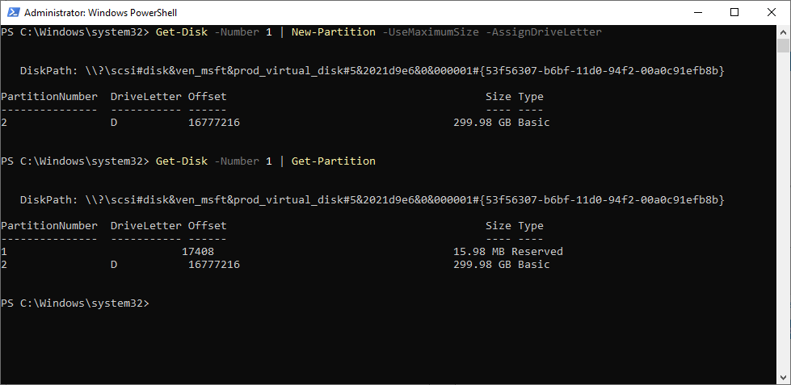


## Exploring Storage Spaces (just storage spaces, not storage spaces direct) with PowerShell

Storage spaces in Microsoft Windows will allow you to create "Virtual Disks" (not that VHD you know, but a disk that looks like a physical disk to the system) but instead of this disk being located on one physical disk, it will span multiple. The data are distributed across disks using storage spaces driver. It will make sure, each of this "virtual disk" data are distributed as per policy you assign (resiliency). The data will be stored in special partition we will now explore.

Storage Spaces require disk, that has no partitions as it will lay out it's own partition and will initialize disk (if not initialized before) on it's own.

As you can see below, disk is no longer available for Storage Spaces as it "has no free space" (you need to update storage provider cache first)

```PowerShell
Get-StorageProvider | Update-StorageProviderCache
Get-PhysicalDisk | Select FriendlyName,Size,*Pool*
 
```

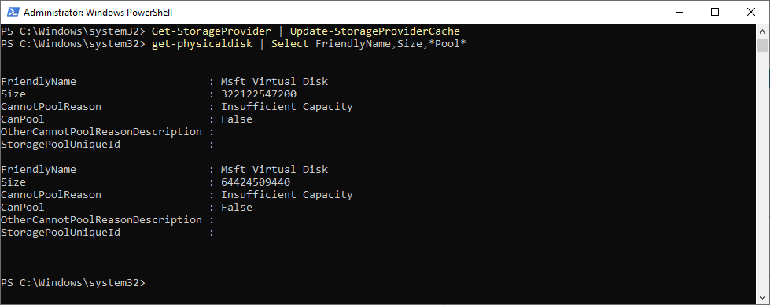

To make disk available again for storage spaces, it must not have any partitions (well, you can keep just one and this trick will make both standard partition and spaces partition visible. But it's not supported/recommended)

```PowerShell
#clear disk 1
Get-Disk -Number 1 | Clear-Disk -RemoveData -RemoveOEM -Confirm:0
Get-StorageProvider | Update-StorageProviderCache
Get-PhysicalDisk | Select FriendlyName,Size,*Pool*
 
```

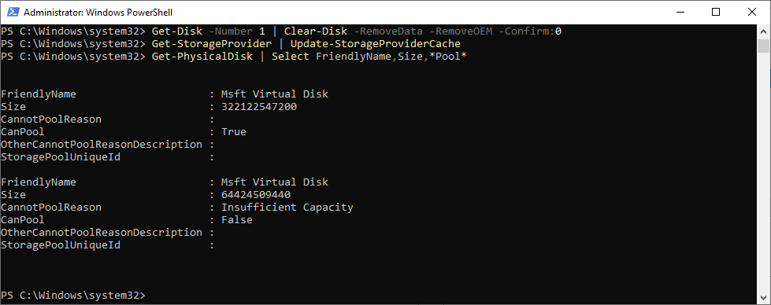

Let's create a storage pool and let's add our disk into it

```PowerShell
New-StoragePool -FriendlyName Pool1 -StorageSubSystemFriendlyName windows* -PhysicalDisks (Get-PhysicalDisk | Where-Object Canpool -eq $true)
 
```

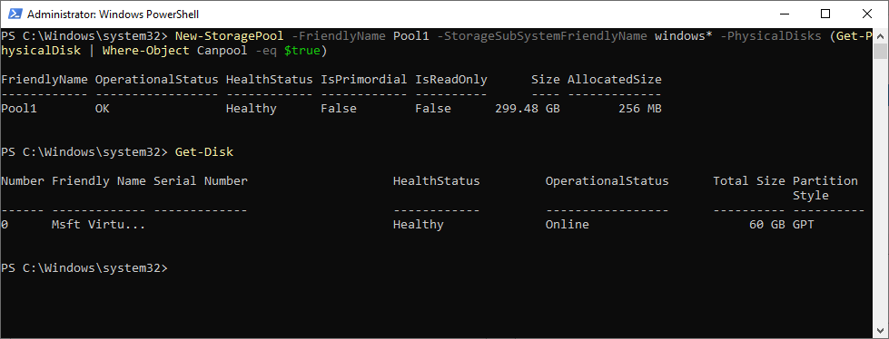

Once storage pool is created, disk is no longer visible with get-disk. Just Get-PhysicalDisk. Therefore we can no longer see partitions as SpacePort will prevent it. Partitions on physical disk will no longer be visible (this prevents software to interact with Storage Spaces data)

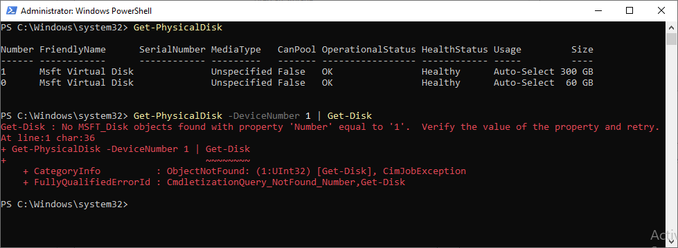

removing pool will make disk visible again

```PowerShell
Get-StoragePool -FriendlyName pool1 | Remove-StoragePool
Get-Disk
 
```

Let's now try to trick disk.sys to expose partitions even with storage spaces enabled.

```PowerShell
#Create 1GB partition
get-disk -Number 1 | New-Partition -Size 1GB
#Create Storage Pool
New-StoragePool -FriendlyName Pool1 -StorageSubSystemFriendlyName windows* -PhysicalDisks (Get-PhysicalDisk | Where-Object Canpool -eq $true)
#get partitions
Get-Disk -Number 1 | Get-Partition
 
```

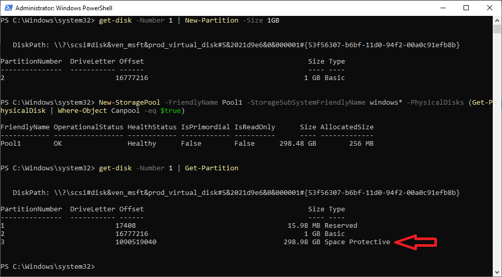

You can also view this partition if you simply pull disk from storage spaces direct lab (VHD in MSLab) and attach it into another VM

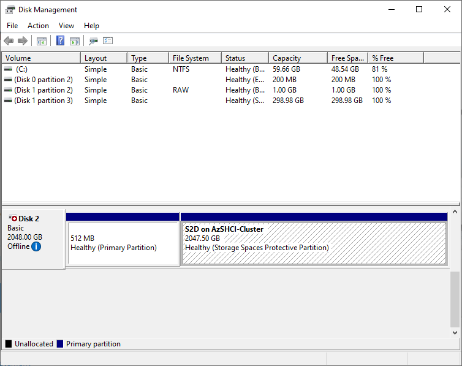

If you will explore partitions with PowerShell, you will be able to see, that there are 2 partitions - one for Metadata and one is Space Protective

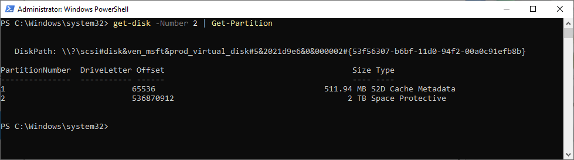