# Storage Bus Layer

<!-- TOC -->

- [Storage Bus Layer](#storage-bus-layer)
    - [Introduction](#introduction)
    - [Resources](#resources)
    - [Storage Bus Function](#storage-bus-function)
    - [Storage Bus Cache](#storage-bus-cache)
    - [SBC PowerShell walkthrough](#sbc-powershell-walkthrough)
- [Software Storage Bus](#software-storage-bus)
    - [SBL PowerShell walkthrough](#sbl-powershell-walkthrough)

<!-- /TOC -->


## Introduction

The goal of the Storage Bus Layer is to consume physical disks that are connected locally in each node and expose to higher layer (in this case to SpacePort - Storage Spaces) as highly available disks - as each disk is then visible to each cluster node.

To achieve this, there are multiple components. The main ones is Storage Bus Cache, that can attach faster media to slower media and expose it as a "Hybrid Disk" (to system it looks like a regular disk, but it is like you would solder a ssd on hdd). The other main component is Software Storage Bus, that makes available remote disks (disks connected to another node) visible as it would be connected locally. It also routes traffic to local node (if data is available locally) or to remote node.

Storage Bus Layer is created when you will run Enable-ClusterStoragePacesDirect. It will consume physical disks and will create metadata partition and spaces protective partition (as discussed in previous chapter)

## Resources

Microsoft Documentation

* https://learn.microsoft.com/en-us/azure-stack/hci/concepts/cache
* https://learn.microsoft.com/en-us/windows-server/storage/storage-spaces/storage-spaces-storage-bus-cache
* https://learn.microsoft.com/en-us/azure-stack/hci/concepts/storage-spaces-direct-overview?f=255&MSPPError=-2147217396#how-it-works
* https://learn.microsoft.com/en-us/windows-server/storage/storage-spaces/storage-spaces-storage-bus-cache


## Storage Bus Function

Once Enable-ClusterStoragePacesDirect (Enable-ClusterS2D) will run, it will detect local spindles that are eligible (does not contain partition, has supported BusType) will construct Storage Bus Cache (and hybrid disks) if it will create Storage Bus Layer.

Once physical disks are claimed, SBL will mask it, so system will not be able to use it and it will also expose virtual spindle so loss of physical path will not tear down dependent stack (until spindle is determined to be failed).


## Storage Bus Cache

As indicated above, Enable-ClusterStorageSpacesDirect will enable Storage Bus Layer. The SBL will then consume disks, and if there is one storage kind faster (Like SSD and HDD) and will present hybrid disks to Spaceport (Storage Spaces). Bindings are determined by random round-robin.

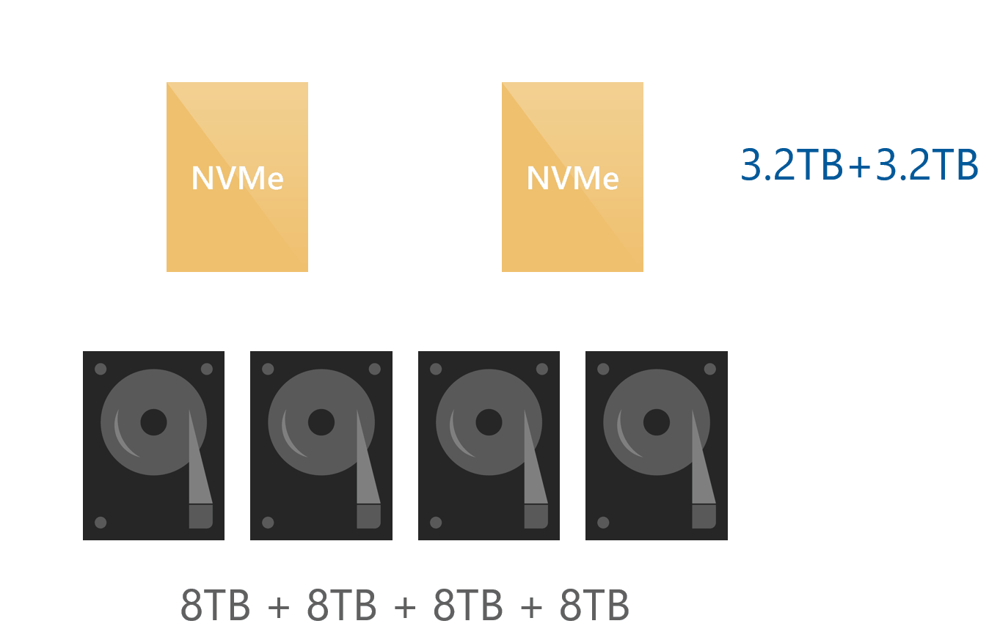

In performance counters you can find "Cluster Storage Hybrid Disk" counters and in instances you will find list of disks and cache devices

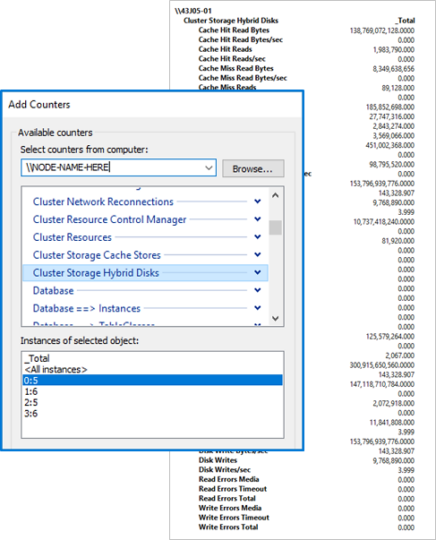

In above example you can see 0:5,1:6,2:5,3:6, where disk0 0-3 is HDD and 5-6 is NVMe (Cache)

Cache is local to each node. Therefore it is important to create a volume for each node to utilize it (as reads are serviced from volume owner). Well one volume (or more) per node also applies as rule for single-tier configs.

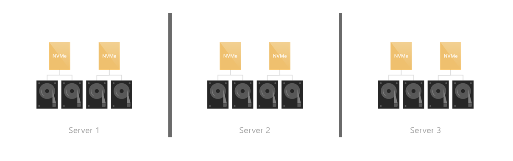

By default, cache is Write Only if slower tier is flash (like combination NVMe+SSD) as SSD is fast enough for reads. Cache is configured as Read/Write

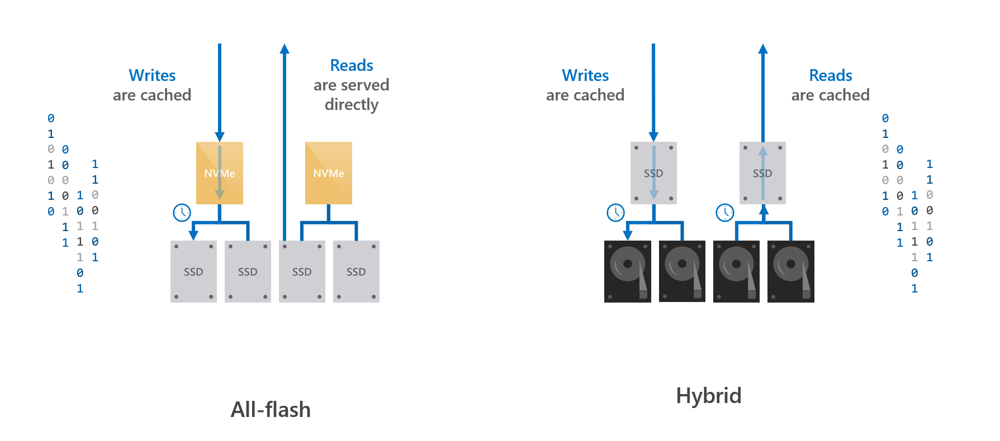


## SBC PowerShell walkthrough

Storage Subsystem on Azure Stack HCI Cluster is "Clustered Windows Storage on ClusterName". This subsystem is created once Storage Spaces Direct is enabled (btw. you can register remote subsystem and work with it as it is local with Register-StorageSubsystem)

```PowerShell
$ClusterName="ax6515-cluster"
Get-StorageSubSystem -CimSession $ClusterName
 
```

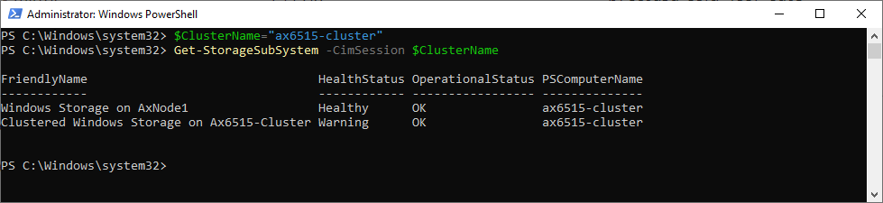

Each storage subsystem has multiple settings - such as what devices are used as a cache (you can [add additional model](https://jtpedersen.com/2019/12/adding-a-new-cache-device-and-you-setup-your-cluster-with-cachedevicemodel-and-now-the-new-device-wont-be-used-as-cache/) if you edit xml), if you want to add disk devices to the pool automatically and what is the pool name.

```PowerShell
$ClusterName="ax6515-cluster"
#list settings
Get-StorageSubSystem -CimSession $ClusterName -FriendlyName Clus* | Get-StorageHealthSetting  -CimSession $ClusterName
#list cache devices model
Get-StorageSubSystem -CimSession $ClusterName -FriendlyName Clus* | Get-StorageHealthSetting  -CimSession $ClusterName -Name System.Storage.SupportedComponents.Document | Select-Object -ExpandProperty Value
 
```

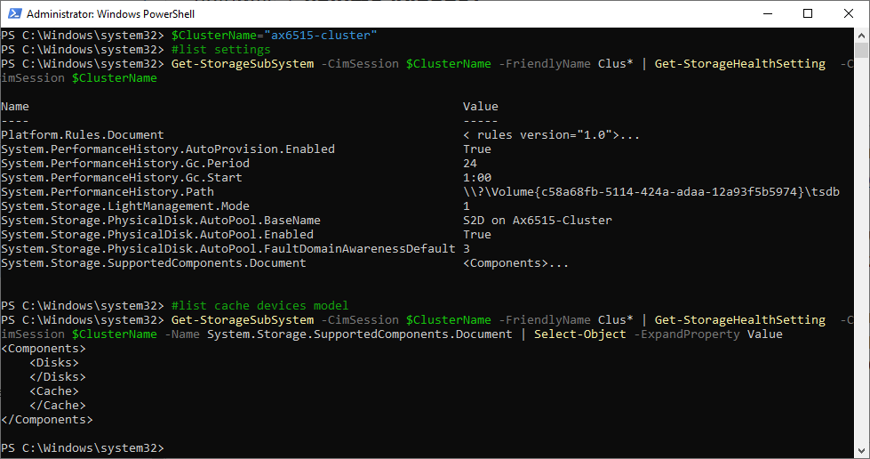

As you can notice, in this cluster are no cache devices (all-flash).

You can also explore cache settings using following command. Notice CacheModeHDD and CacheModeSSD

```PowerShell
$ClusterName="ax6515-cluster"
Get-ClusterStorageSpacesDirect -CimSession $ClusterName
 
```

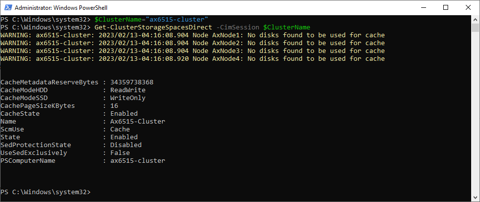

With Windows Server 2022 and Azure Stack HCI 21H2 was new module released. You can explore bindings and many more. Storage Bus Cache was also added for [standalone servers](https://learn.microsoft.com/en-us/windows-server/storage/storage-spaces/storage-spaces-storage-bus-cache)

```PowerShell
$ClusterName="ax6515-cluster"
Invoke-Command -ComputerName $ClusterName -ScriptBlock {Get-StorageBusCache}
Get-Command -Module StorageBusCache
 
```

While CachePageSizeBytes can be adjusted, it's not recommended as it specifies the page size used by Storage Spaces Direct cache. 

CachePageSize is the granularity with which data moves in/out of the cache. The default is 16 KiB. Finer granularity improves performance but requires more memory.

For example, decreasing CachePageSize to 4 KiB would quadruple the memory usage, from ~4 GB per 1 TB of cache to ~16 GB per 1 TB of cache!

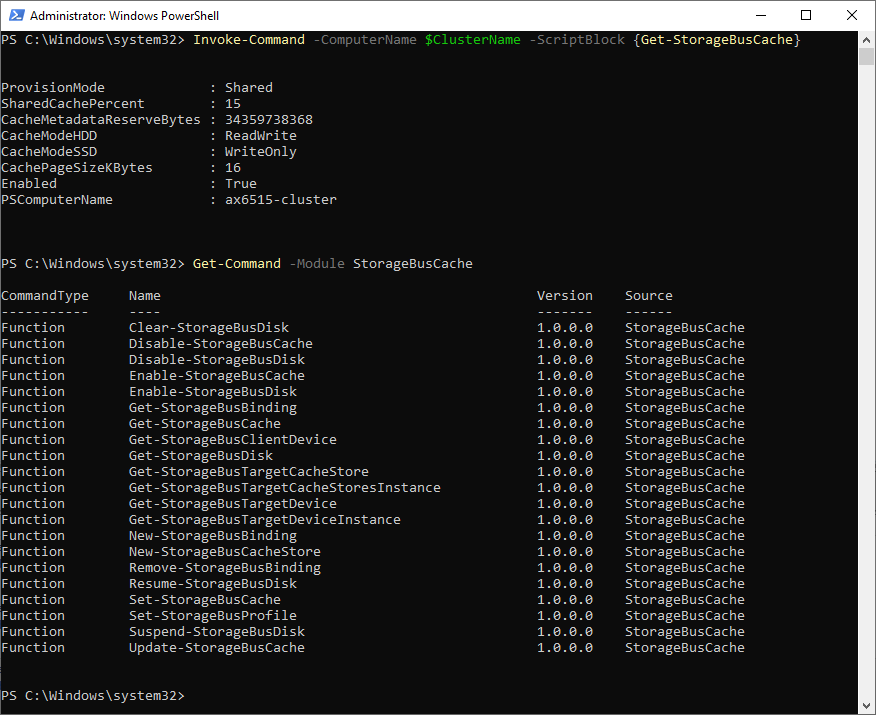

# Software Storage Bus

In traditional layout (let's say Storage Spaces in Windows Server 2012) you could connect multiple enclosures with SAS cables to each physical server. SAS is multipath, therefore multiple servers were able to see multiple disks. When one server failed, storage failed over to another node.

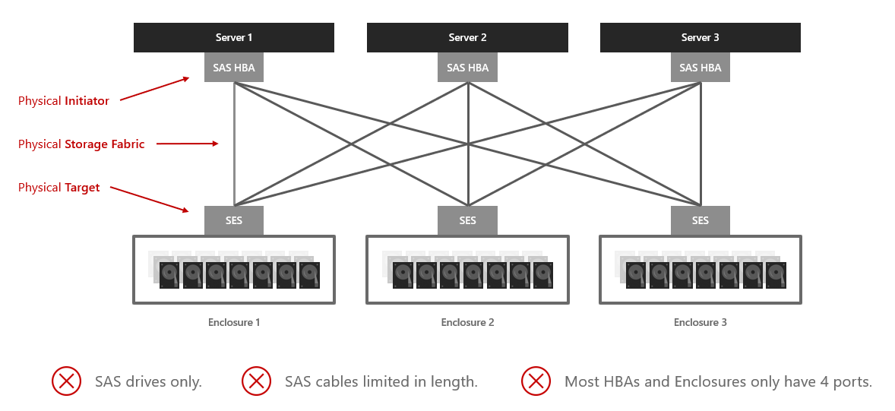

This approach has multiple limitations. You cannot use cheap disks (SATA), you cannot use high-performance disks connected to PCI-E (NVMe) and you have physical layout limitations (largest solution from Dell was 4 servers with 4 enclosures).

To address this, Microsoft developed software storage bus, that replaces physical Initiator, Storage Fabric and Target.

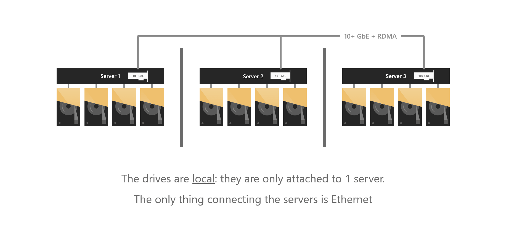

The connection is established via SMB on special instance.There are multiple SMB instances in system - SBL (Storage Bus Layer), SR (Storage Replica), CSV (Cluster Shared Volume) and Default.

Connection is initialized by ClusPort.sys (Cluster miniport Driver) and the target is ClusBFlt.sys (Cluster block target driver and Filter driver)

Storage bus layer also makes sure:

* Fair device access from any node
* Handles IO prioritization (App vs System) -Variable repair speed
* De-randomization of random IO and drives sequential IO pattern (spinning media only)

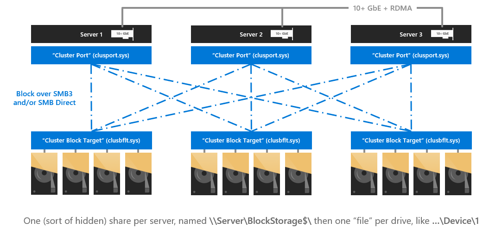

Bandwidth is critical. Therefore Dell recommends using 25Gbps. With NVMes we even saw benefit using 4x100Gbps NICs as we were able to saturate 2x100Gbps connection. 100Gbps is just 12.5GB/s (in real world ~11GB/s)

## SBL PowerShell walkthrough

List all available file shares in SMB Instance SBL (Storage Bus Layer). As you can see, it's provided as BlockShare$ share and the path is ClusBFLT (Cluster block target and filter driver), our SBL Target

```PowerShell
$ClusterName="ax6515-cluster"
$ClusterNodes=(Get-ClusterNode -Cluster $ClusterName).Name
Get-SmbShare -CimSession $ClusterNodes -SmbInstance SBL
 
```

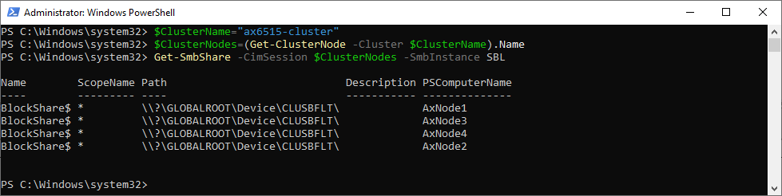

To see SBL Initiator, you can query SMB Connections

```PowerShell
$ClusterName="ax6515-cluster"
$ClusterNodes=(Get-ClusterNode -Cluster $ClusterName).Name
Get-Smbconnection -CimSession $ClusterNodes -SmbInstance SBL
 
```

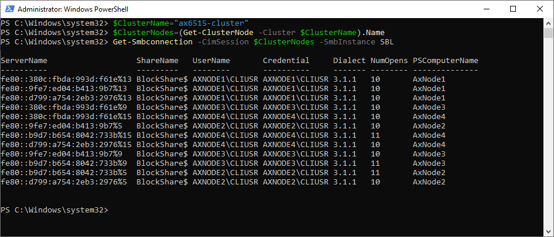

You can also check repair speed (IO Prioritization). Default is 4 https://learn.microsoft.com/en-us/azure-stack/hci/manage/storage-repair-speed

```PowerShell
$ClusterName="ax6515-cluster"
Get-StorageSubSystem -FriendlyName Clus* -CimSession $ClusterName | Select FriendlyName,VirtualDiskRepairQueueDepth
 
```

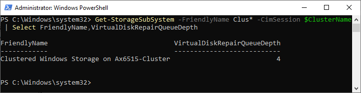

