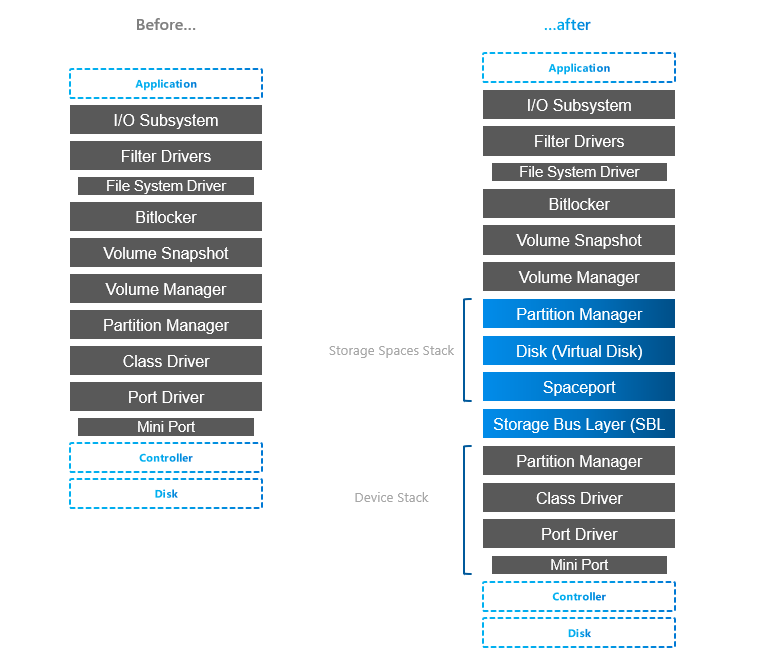
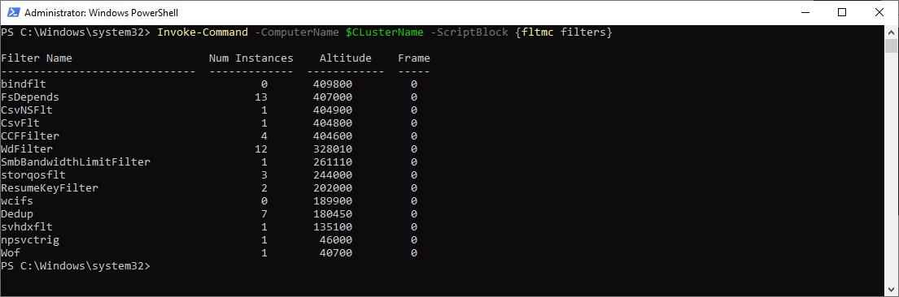

# Storage Stack Overview

<!-- TOC -->

- [Storage Stack Overview](#storage-stack-overview)
    - [Layers below S2D Stack](#layers-below-s2d-stack)
        - [Port & Miniport driver](#port--miniport-driver)
        - [Class Driver](#class-driver)
        - [Partition Manager](#partition-manager)
    - [S2D Stack](#s2d-stack)
        - [Storage Bus Layer](#storage-bus-layer)
        - [Spaceport](#spaceport)
        - [Virtual Disk](#virtual-disk)
    - [Layers above S2D Stack](#layers-above-s2d-stack)
        - [Volume Manager](#volume-manager)
        - [Volume Snapshot](#volume-snapshot)
        - [Bitlocker](#bitlocker)
        - [Filter Drivers](#filter-drivers)

<!-- /TOC -->

## Introduction 

Understanding Storage Stack is crucial for understanding what technologies are involved and how (where storage replica is, where is ReFS Multi-resilient Volume, ...). Understanding how layers are stacked will also help when IO flow is troubleshooted - like reviewing performance counters or troubleshooting core functionality.

Traditional stack compared to storage spaces stack (note that MPIO is missing, but for Storage Spaces Direct it's not needed as there is only one path to the physical device, so it was omitted)

You can notice 4 "new" layers, but actually it's just Spaces layer (Spaceport) and Storage Bus Layer.

To better understand what's in the stack, you can also explore some parts with PowerShell

Anyway, let's explore layers a bit. Following info is based on storage description someone somewhere created and pushed to internet. The only version I found was from webarchive and I copied it here 

## Layers below S2D Stack

### Port & Miniport driver

storport.sys & stornvme.sys

Port drivers implement the processing of an I/O request specific to a type of I/O port, such as SATA, and are implemented as kernel-mode libraries of functions rather than actual device drivers. Port driver is written by Microsoft (storport.sys). If third party wants to use write their own device driver (like HBA), then it will use miniport driver (except if device is NVMe, then miniport driver is Microsoft stornvme.sys)

Miniport drivers usually use storport.sys performance enhancements such as support for the paralell execution of IO.

[storage port drivers](https://docs.microsoft.com/en-us/windows-hardware/drivers/storage/storage-port-drivers)
[storage miniport drivers](https://docs.microsoft.com/en-us/windows-hardware/drivers/storage/storage-miniport-drivers)

### Class Driver

disk.sys

A [storage class driver](https://docs.microsoft.com/en-us/windows-hardware/drivers/storage/introduction-to-storage-class-drivers) (typically disk.sys) uses the well-established SCSI class/port interface to control a mass storage device of its type on any bus for which the system supplies a storage port driver (currently SCSI, IDE, USB and IEEE 1394). The particular bus to which a storage device is connected is transparent to the storage class driver.

Storage class driver is responsible for claiming devices, interpreting system I/O requests and [many more](https://docs.microsoft.com/en-us/windows-hardware/drivers/storage/storage-class-driver-s-general-functionality)

In Storage Spaces stack (Virtual Disk) disk.sys is responsible for claiming Virtual Disk exposed by spaceport (storage spaces)

### Partition Manager

partmgr.sys

Partitions are handled by partmgr.sys. Partition is usually GPT or MBR (preferably GPT as MBR has many limitations such as 2TB size limit)

As you can see in the stack, there are two partition managers. One partition layout is on physical disk and it is then consumed by storage spaces (spaceport).

On the picture below you can see individual physical disk from spaces exposed and it's partitions showing metadata partition and partition containing pool data (normally not visible as it's hidden by partmgr.sys when it detects spaces).

## S2D Stack

### Storage Bus Layer

clusport.sys and clusblft.sys

These two drivers (client/server) are exposing all physical disk to each cluster node, so it looks like all physical disks from every cluster node are connected to each server. For interconnect is SMB used, therefore high-speed RDMA can be used (recommended).

It also contains SBL cache.

### Spaceport

spaceport.sys

Claims disks and adds them to storage spaces pool. It creates partitions where internal data structures are metadata are kept (see screenshot in partition manager).

Defines resiliency when volume (virtual disk) is created (creates/distributes extents across physical disks)

### Virtual Disk

disk.sys is now used by storage spaces and exposes virtual disk that was provisioned using spaceport.sys

## Layers above S2D Stack

### Volume Manager

dmio.sys, volmgr.sys

Volumes are created on top of the partition and on volumes you can then create filesystems and expose it to the components higher in the stack.

### Volume Snapshot

volsnap.sys

Volsnap is the component that creates system provider for the volume [shadow copy service (VSS)](https://docs.microsoft.com/en-us/windows-server/storage/file-server/volume-shadow-copy-service). This service is controller by vssadmin.exe

### Bitlocker

fvevol.sys

Bitlocker is well known disk encryption software that is on the market since Windows Vista. In PowerShell you can expose volume status with Get-BitlockerVolume command. 

### Filter Drivers

Interesting about filter drivers is, that all FileSystem drivers are actually filter drivers - special ones, File System Drivers - like REFS.sys, NTFS.sys, Exfat.sys ... 

You can learn more about filesystem using fsutil

There are also many first party and third party filter drivers. You can expose those with fltmc command

As you can see on above example, there are many filters like Cluster Shared Volume (CsvNSFlt, CsvFLT), deduplication (Dedup), shared vhd (svhdxflt), storage QoS (storqosflt) and many more. Each filter driver has defined altitude and 3rd parties can (reserve theirs)[https://docs.microsoft.com/en-us/windows-hardware/drivers/ifs/allocated-altitudes]
